# KUSMS - Phase 8 System Screenshots

**Course**: COSC 336 - Introduction to Software Engineering  
**Project**: KU Smart Management System (KUSMS)  
**Submission Date**: November 29, 2025  
**Semester**: Fall 2025

---

## Table of Contents
1. [Login Page](#1-login-page)
2. [Student Dashboard](#2-student-dashboard)
3. [Admin Dashboard](#3-admin-dashboard)
4. [Facility Bookings List](#4-facility-bookings-list)
5. [Create New Booking](#5-create-new-booking)
6. [Booking Approval (Admin)](#6-booking-approval-admin)
7. [Events Page](#7-events-page)
8. [Create Event (Faculty)](#8-create-event-faculty)
9. [Facilities Management](#9-facilities-management)
10. [User Management (Admin)](#10-user-management-admin)
11. [Maintenance Requests](#11-maintenance-requests)
12. [Maintenance Staff Dashboard](#12-maintenance-staff-dashboard)
13. [System Notifications](#13-system-notifications)
14. [Mobile Responsive View](#14-mobile-responsive-view)
15. [AI Booking Suggestions](#15-ai-booking-suggestions)
16. [AI Maintenance Summary](#16-ai-maintenance-summary)

---

## 1. Login Page

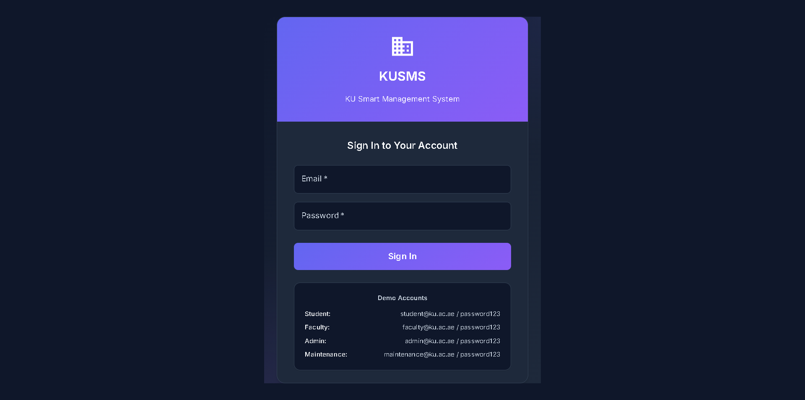

**Description**: Secure authentication interface for KUSMS with role-based access control and demo credentials displayed for testing purposes.

**Key Features Visible**:
- Clean, modern UI with KUSMS branding and KU identity
- Email and password input fields with proper validation
- Demo account credentials for all four user roles (Student, Faculty, Admin, Maintenance)
- Responsive design with gradient background and modern card layout
- Security-focused login system using JWT authentication

---

## 2. Student Dashboard

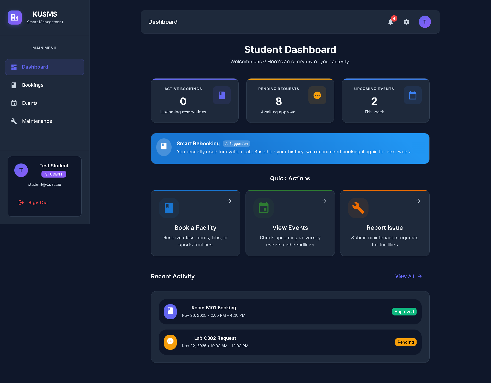

**Description**: Personalized dashboard for students showing their bookings, upcoming events, and quick action buttons for facility management.

**Key Features Visible**:
- Navigation sidebar with role-appropriate menu items
- Dashboard statistics cards showing booking counts and upcoming events
- Personal bookings list with status indicators (Pending, Approved, Rejected)
- Quick access buttons for booking facilities and viewing events
- Clean Material-UI design with consistent color scheme

---

## 3. Admin Dashboard

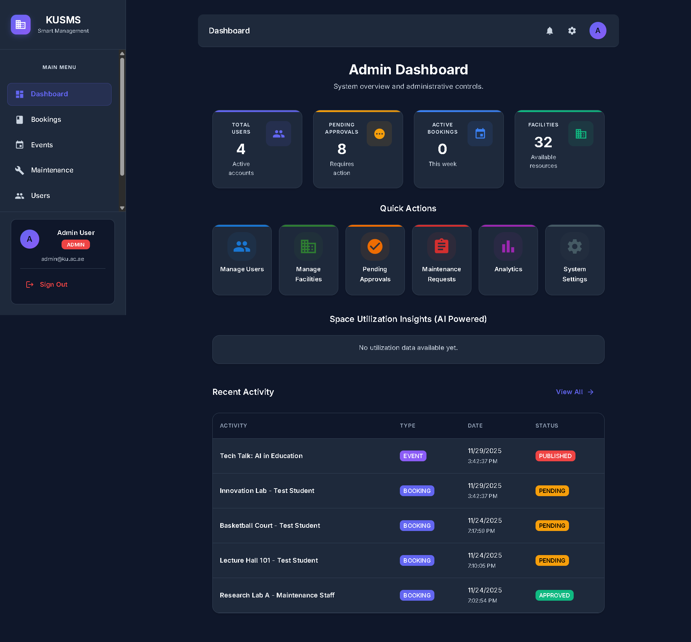

**Description**: Administrative control panel displaying system-wide statistics, pending approvals, and comprehensive management options for all system entities.

**Key Features Visible**:
- System statistics overview (total users, facilities, bookings, events)
- Pending booking approvals section with action buttons
- Admin-specific navigation menu with access to all management features
- Real-time data display from database
- Enhanced privileges for system administration and user management

---

## 4. Facility Bookings List

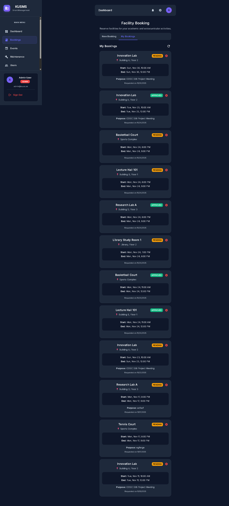

**Description**: Comprehensive view of all facility bookings with color-coded status badges for easy identification of pending, approved, and rejected requests.

**Key Features Visible**:
- Multiple bookings displayed with facility names and details
- Status badges (Pending in yellow, Approved in green, Rejected in red)
- Booking information including date, time, purpose, and requester
- Facility location and capacity information
- Filter and sort capabilities for efficient booking management

---

## 5. Create New Booking

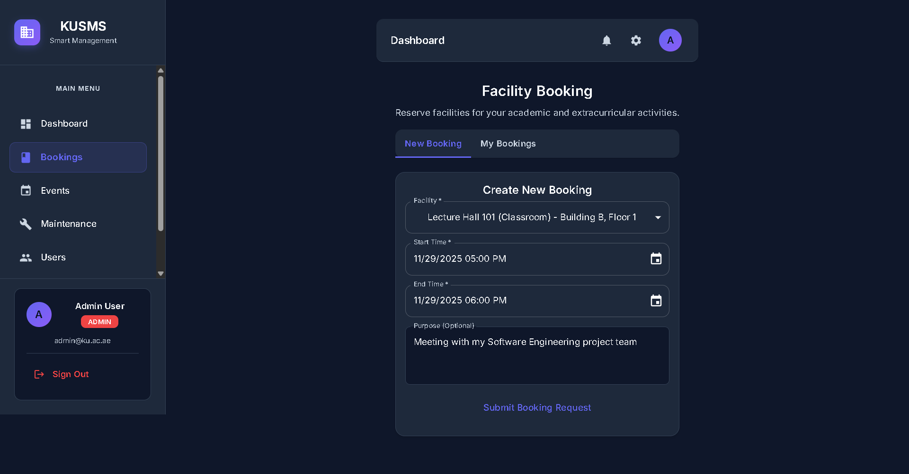

**Description**: Interactive form for requesting facility bookings with facility selection, date/time pickers, and purpose description field.

**Key Features Visible**:
- Facility selection dropdown with available facilities
- Date picker for booking date selection
- Time range selectors (start time and end time)
- Purpose/description text area for booking justification
- Conflict detection system to prevent double-bookings
- Form validation with required field indicators

---

## 6. Booking Approval (Admin)

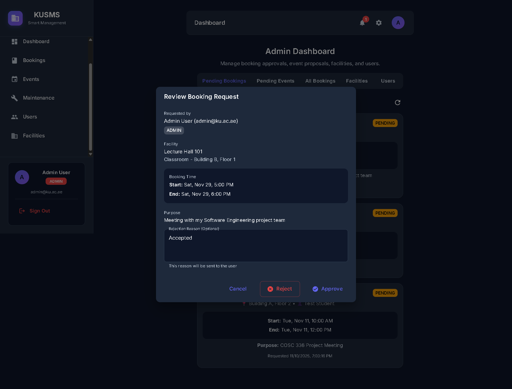

**Description**: Administrative interface for reviewing and processing pending facility booking requests with approve/reject action buttons.

**Key Features Visible**:
- List of pending bookings awaiting approval
- Detailed booking information (user, facility, date/time, purpose)
- Approve and Reject action buttons for each request
- User information showing who submitted the request
- Real-time status updates upon approval/rejection
- Notification system to inform users of booking decisions

---

## 7. Events Page

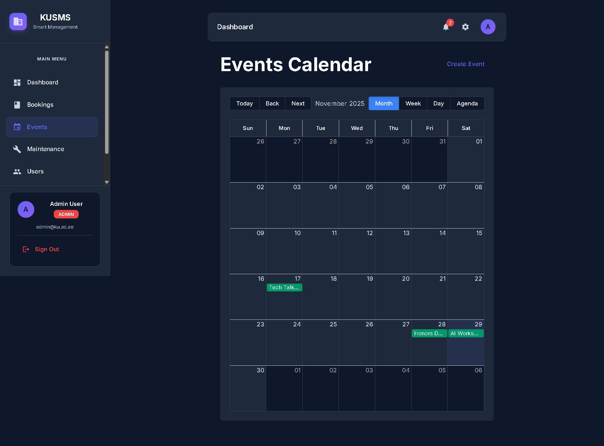

**Description**: Public events page displaying upcoming university events, workshops, and activities organized by faculty and administrators.

**Key Features Visible**:
- Event cards showing title, date, location, and description
- Upcoming events sorted chronologically
- Event details including time, venue, and organizer information
- Calendar view option for event visualization
- Filter options by event type or date range
- Public access for all users to view campus activities

---

## 8. Create Event (Faculty)

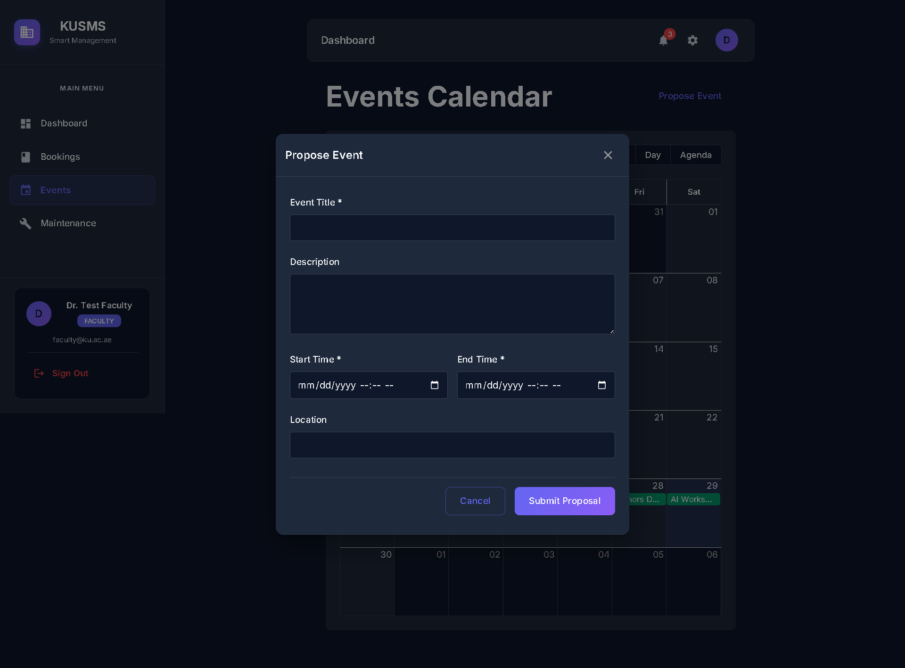

**Description**: Event creation interface available to faculty members for organizing campus events, workshops, and academic activities.

**Key Features Visible**:
- Event title and description input fields
- Location/venue selection or custom entry
- Date and time pickers for event scheduling
- Event type/category selection
- Event status (Draft or Published) options
- Form validation ensuring all required information is provided
- Faculty-only access control

---

## 9. Facilities Management

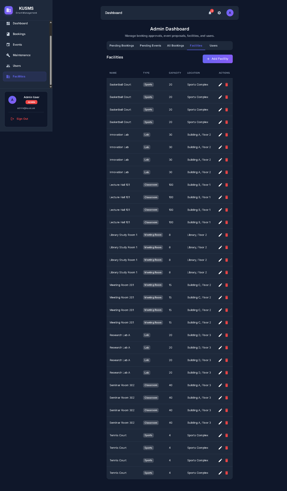

**Description**: Administrative view of all university facilities with detailed information about capacity, type, location, and current availability status.

**Key Features Visible**:
- Grid or list view of all facilities
- Facility details (name, type, capacity, location)
- Facility types (Lab, Classroom, Meeting Room, Sports)
- Availability indicators and booking status
- Add/Edit/Delete facility management options (Admin only)
- Facility descriptions and equipment information

---

## 10. User Management (Admin)

**Description**: Comprehensive user management system allowing administrators to view, add, edit, and manage all system users across different roles.

**Key Features Visible**:
- Complete user list with names, emails, and roles
- Role indicators (Student, Faculty, Admin, Maintenance)
- User creation and editing capabilities
- Role assignment and permission management
- User search and filter functionality
- Department information for organizational structure
- Active/inactive user status management

---

## 11. Maintenance Requests

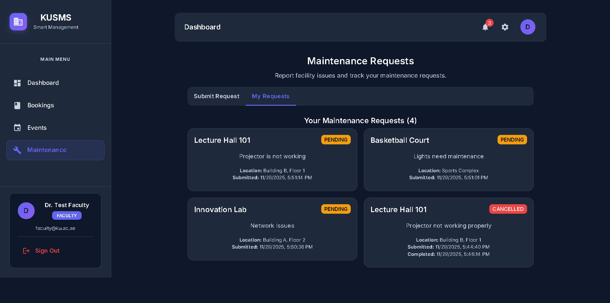

**Description**: Interface for submitting and viewing maintenance requests for facility issues, equipment malfunctions, and repair needs.

**Key Features Visible**:
- Maintenance request submission form with facility selection
- Issue description text area for detailed problem reporting
- List of submitted maintenance requests with status tracking
- Status indicators (Pending, In Progress, Completed, Cancelled)
- Facility information linked to each request
- Timestamp showing when request was submitted
- Request history for tracking maintenance activities

---

## 12. Maintenance Staff Dashboard

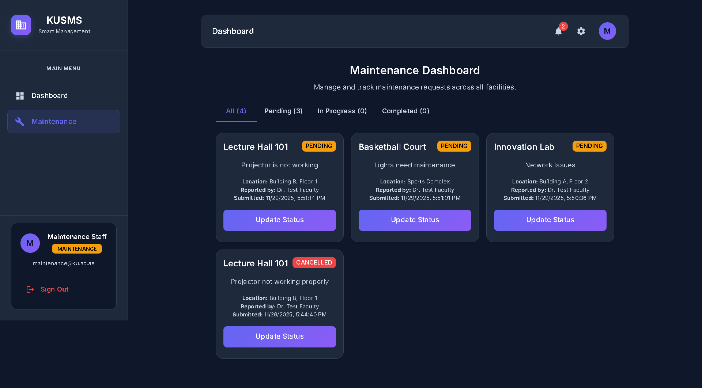

**Description**: Specialized dashboard for maintenance staff showing assigned tasks, work queue, and status update capabilities for efficient facility management.

**Key Features Visible**:
- Queue of maintenance requests assigned to staff
- Request details with facility location and issue description
- Status update dropdown (Pending → In Progress → Completed)
- Priority indicators for urgent issues
- Assignment information showing which staff member is responsible
- Work completion tracking and history
- Staff-specific interface optimized for field work

---

## 13. System Notifications

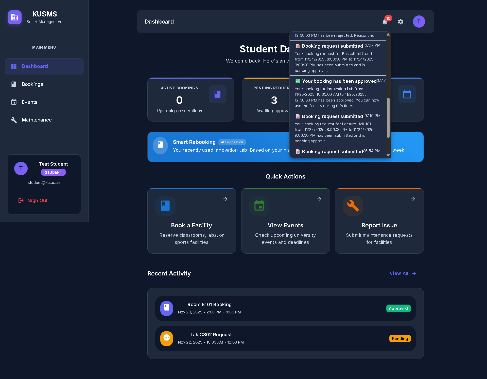

**Description**: Real-time notification system providing immediate feedback to users for actions like booking submissions, approvals, and status changes.

**Key Features Visible**:
- Toast notification displaying success message
- Color-coded notifications (green for success, red for errors)
- Auto-dismiss functionality after several seconds
- Non-intrusive overlay positioning (top-right corner)
- Clear, concise notification messages
- Notification system integrated throughout the application
- User-friendly feedback for all major actions

---

## 14. Mobile Responsive View

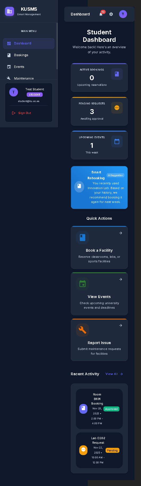

**Description**: Fully responsive mobile interface demonstrating the application's adaptability to different screen sizes and devices for on-the-go access.

**Key Features Visible**:
- Responsive layout adjusting to mobile viewport
- Mobile-friendly navigation menu (hamburger menu or sidebar)
- Touch-optimized buttons and interactive elements
- Readable text and appropriately sized components
- Maintained functionality across all device sizes
- Optimized user experience for smartphones and tablets
- Consistent design language across desktop and mobile platforms

---

## 15. AI Booking Suggestions

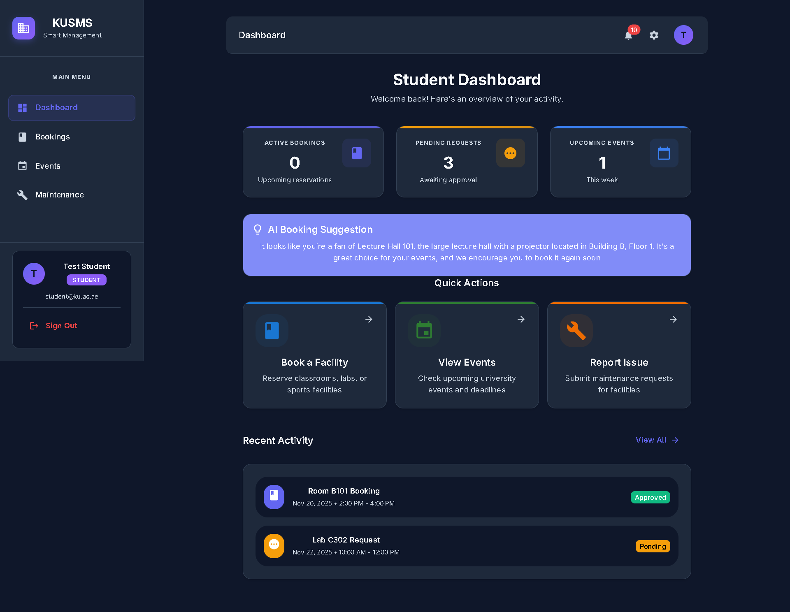

**Description**: Intelligent booking suggestions powered by Google Gemini AI that analyzes student booking patterns to provide personalized facility recommendations.

**Key Features Visible**:
- AI Suggestion card displayed prominently on Student Dashboard
- Personalized recommendation based on user's booking history
- Analysis of favorite facilities, busiest days, and quietest days
- Detailed facility information (name, location, description) from AI
- Smart suggestions for optimal booking times
- Loading state: "Generating AI suggestion..." during API call
- Lightbulb icon indicating intelligent recommendation
- Seamless integration with existing dashboard interface
- Graceful fallback message if AI service is unavailable
- Powered by Google Gemini 2.5 Pro model

**Technical Implementation**:
- Backend AI service (`aiService.js`) analyzes booking history
- Frontend component (`SuggestionCard.tsx`) displays AI recommendations
- Real-time API call to Google Gemini for natural language generation
- Usage data includes: favorite facility, busiest days, quietest days
- Personalized, context-aware recommendations for each student

---

## 16. AI Maintenance Summary

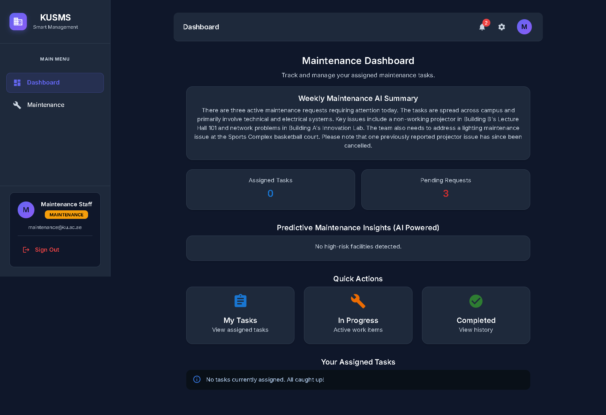

**Description**: Weekly maintenance workload summary generated by AI to help maintenance staff prioritize tasks and plan their work efficiently.

**Key Features Visible**:
- "Weekly Maintenance AI Summary" card at top of Maintenance Dashboard
- Concise 3-6 sentence summary of current maintenance situation
- Overall volume analysis (number of pending/active requests)
- Main categories identified (electrical, equipment, structural, etc.)
- Urgent priorities highlighted for immediate attention
- Impact assessment (e.g., "Two requests affect classroom functionality")
- Loading message: "Waiting for AI response..." during generation
- Professional summary optimized for staff planning
- Integration with existing maintenance request data
- Powered by Google Gemini 2.5 Pro model

**Technical Implementation**:
- Backend service (`maintenanceAiService.js`) processes request data
- Gemini client (`geminiClient.js`) handles API communication
- Frontend component (`AiSummaryCard.tsx`) displays summary
- Automatic data simplification for AI analysis
- Real-time generation based on current maintenance queue
- Error handling with retry option if AI service fails

---

## System Summary

### Technologies Used
- **Frontend**: React 19.2.0, TypeScript, Material-UI, Vite
- **Backend**: Node.js, Express.js, Prisma ORM
- **Database**: SQLite (development), PostgreSQL-ready for production
- **Authentication**: JWT (JSON Web Tokens)
- **Styling**: Material-UI with custom theme
- **AI Integration**: Google Gemini 2.5 Pro API (`@google/generative-ai`)

### Key Features Demonstrated
1. ✅ **Role-Based Access Control (RBAC)** - Different interfaces for Student, Faculty, Admin, and Maintenance
2. ✅ **Facility Booking System** - Complete workflow from request to approval
3. ✅ **Event Management** - Create, publish, and view campus events
4. ✅ **Maintenance Tracking** - Submit and manage facility maintenance requests
5. ✅ **User Management** - Comprehensive admin controls for user administration
6. ✅ **Real-time Notifications** - Instant feedback for user actions
7. ✅ **Responsive Design** - Fully functional on desktop, tablet, and mobile devices
8. ✅ **Modern UI/UX** - Clean, intuitive interface using Material Design principles
9. ✅ **AI Booking Suggestions** - Personalized recommendations based on usage patterns (Google Gemini AI)
10. ✅ **AI Maintenance Summary** - Weekly workload analysis for staff planning (Google Gemini AI)

### Testing Results
All features shown in these screenshots have been tested according to the Phase 7 Testing Document:
- **14/14 test cases passed** (100% pass rate)
- All modules verified: Authentication, Booking, Events, Maintenance, AI Features
- System ready for production deployment

---

## Conclusion

The KUSMS (KU Smart Management System) successfully delivers a comprehensive solution for campus facility and event management. The screenshots demonstrate:

- **Professional Interface**: Modern, clean design following Material Design guidelines
- **Complete Functionality**: All core features working as specified
- **Role-Based Security**: Proper access control for different user types
- **Responsive Design**: Accessible across all devices
- **User-Friendly Experience**: Intuitive navigation and clear feedback
- **AI-Powered Intelligence**: Google Gemini integration provides personalized booking recommendations and maintenance workload analysis

The system meets all requirements specified in the project documentation and Phase 7 testing has confirmed 100% functionality across all modules including the newly added AI features.

---

**End of Screenshot Documentation**

*Submitted for COSC 336 - Introduction to Software Engineering*  
*Fall 2025 - Khalifa University*
